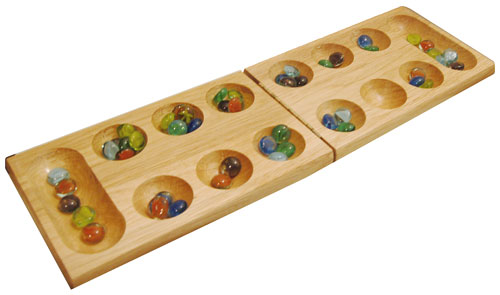
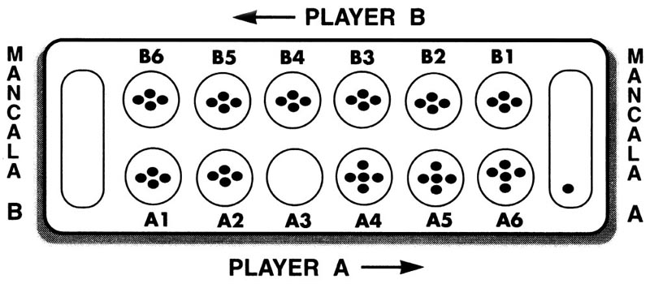

#M a n c a l a

-
##Developer: Adrian Nuyda

Trello: <b>https://trello.com/b/uVdPkGSw/project-1-mancala</b>

#####Technologies used:
<li> HTML
<li> CSS
<li> JavaScript
<li> jQuery

##Table of Contents
<ol>
	<li> Design Approach
	<li> How to Install
	<li> How to Play
	<li> Unsolved Problems
</ol>
-

####<b>2. <u>Design Approach</u></b>
The moment I've wanted to create Mancala, I wanted to design it with an arcade/8-bit theme. I've added music that will fit perfectly with the background image so users will get a feel of that space-cy-atmosphere environment when playing my game. Moreover, I've also added mario sound effects to give it that retro feeling.

-
####<b>2. <u>How to Install</u></b>

1. Open up your browser.
2. Copy and paste this link to your url browser. <b>
http://adrianxadamn.github.io/project1/ </b>

####<b>3. <u>How to Play</u></b>

#####Vocabulary:

<li><b>Seeds</b> - located inside a pit. These seeds are waiting to be captured and put into your storage.
<li><b>Pit</b>  - located on the field that holds your seeds. 
<li><b>Storage</b>  - contains all of your seeds during the game. The player with the most seeds inside their storage by the end of the game wins.

######Move Phase

Each player takes turn to play seeds. During their turn, a player must choose one non-empty pit from their side of the field. When selecting a pit, the player will grab all of the seeds from the pit. The player will then drop a single seed into the next pit in a <b><u><i>counter-clock wise direction</b></u></i> until he runs out of seeds from his hand. 

<i> The player is <u><b>NOT ALLOWED</u></b> to drop their seeds into the opponent's storage. 
</i>

######Move Again Phase
If the player drops their last seed into their storage, then that player is allowed to make another move. 

######Capture Phase
If the last seed you drop is an empty hole on your side, you can capture that seed and all seeds from your opponent's pit and transfer them into your storage. <i><b> WARNING: This only works if the opponent's pit has more than one seed inside.</i></b>

######Game Over
If a player does not have anymore seeds in his field, then the game is over. The other player will then capture all of his seeds left on their field and transfer them to their storage.

######Winner

The winner is the player who has the most pieces in their storage.
	
####<b>4. <u>Unsolved Problems</u></b>

<i>Please avoid from clicking two pits during a turn.</i> The only problem that I have with my game is that you are able to possibily move twice during your turn which will completely mess up logic of the game. Simply restart the game if you had encountered this unsolved problem.

